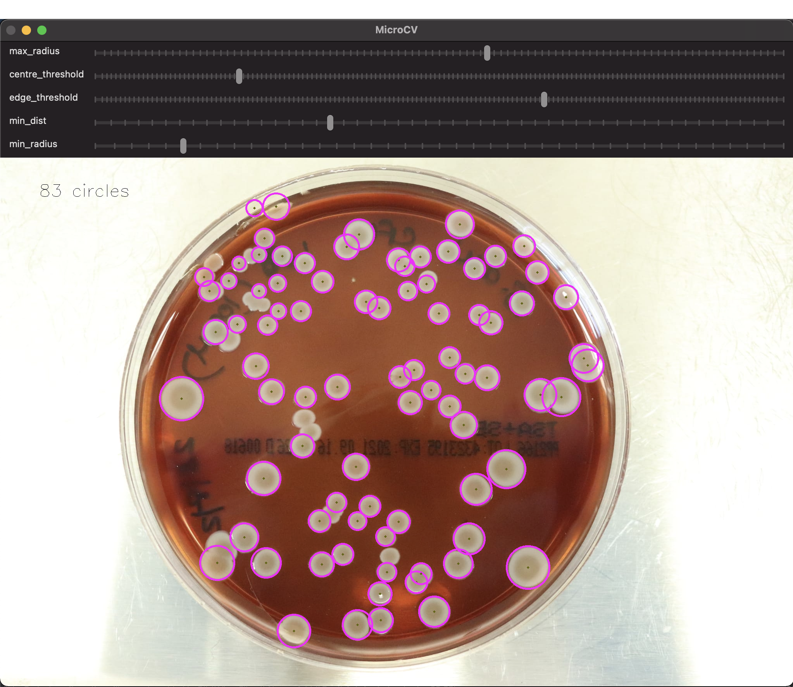

# MicroCV
_Petri dish OpenCV feature detection_

## Installation

Assuming Python 3 and Pip are installed, run 
`python -m pip install -r requirements.txt` to set up the necessary requirements. Replace `python` with your own python 
installation alias if needed.

## Usage

From the command line, run `python main.py IMAGE_FILENAME`, where `IMAGE_FILENAME` is the petri dish image to analyze 
(e.g. `example1.png`).

Quit the Python window by pressing `q`, or quitting the process from the command line.

Save a snapshot of the analyzed image (with circles overlaid) by pressing `s`. This image will be saved in the
`saved_images` folder. 

## Interface

The provided sliders may be used to refine the feature detection parameters. The sliders correspond to the following parameters:

- min_dist: Minimum distance between detected centers.
- edge_threshold: Upper threshold for the internal Canny edge detector.
- centre_threshold: Threshold for center detection.
- min_radius: Minimum radius to be detected. If unknown, put zero as default.
- max_radius: Maximum radius to be detected. If unknown, put zero as default.

>*Note that even with optimal settings, some features may not be detected. MicroCV is a tool intended to _aid_ microbial 
growth enumeration -- not automate it entirely. It is your responsibility to manually add false negatives / remove false positives from your tally.*    

## Background info

The algorithm behind MicroCV works in three steps: 
- first, it pre-processes the provided image by gray-scaling and blurring it
- next, it applies [Circle Hough Transforms](https://en.wikipedia.org/wiki/Circle_Hough_Transform) to the image with 
parameters defined by the interface sliders, extracting the locations of all detected growths
- lastly, circles are drawn at the extracted location and radius.

While binary mask -based algorithms are generally preferred for petri dish analysis, this CHT-based algorithm performs
better given petri dish images with complex backgrounds, as was specified here.  
